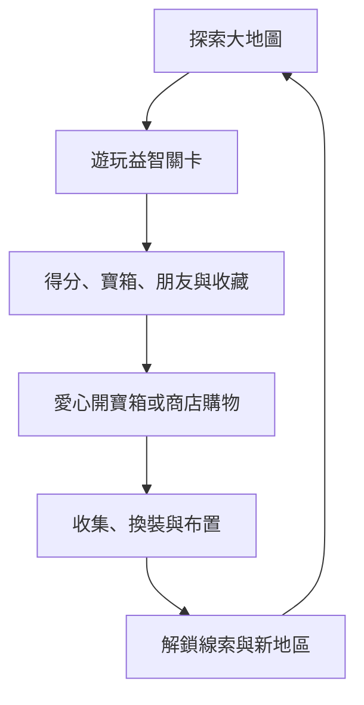

# 森林益智樂園｜專案總整理與開發進度表 v1.2

> 整理日期：2026-09-08  
> 目前定位：PC 端優先的 Phaser 靜態網頁遊戲，後續再擴充 GitHub Pages、手機瀏覽器與 App 封裝。

---

## 1. 進度標記說明

| 標記 | 意義 |
|---|---|
| ✅ 已完成／已測試 | 已製作更新檔，且已有基本功能測試或玩家測試 |
| 🟡 雛型完成 | 可遊玩，但仍需美術、數值、介面或完整專案整合 |
| 🟠 已定案待開發 | 方向已確定，但還沒有完整寫入遊戲 |
| ⚪ 構想中 | 可保留的候選內容，仍需規則定案 |
| ⏸ 後期 | 目前不建議開工，應先完成共用框架 |

本文中的「已完成」代表曾經完成更新檔或雛型，不代表已經全部合併到使用者電腦中的最新主專案。下一階段應先做一次「完整基準版整合」。

---

## 2. 遊戲核心定位

### 2.1 整體方向

《森林益智樂園》不再只是五個各自獨立的小遊戲，而是：

> 以幼童益智遊戲為核心，讓玩家探索森林、結交森林朋友、開啟寶箱、解鎖商品與地圖，逐步發現隱藏世界的兒童冒險樂園。

### 2.2 長期核心循環

### 2.3 已確定的設計原則

- 幼童版優先，目標年齡包含約 4 歲幼童。
- 遊戲可無限重玩，不用愛心限制進場。
- 幼童版重視大圖示、寬鬆判定、簡短玩法與正向回饋。
- 挑戰／成人版可與幼童版共用主題和收集紀錄，但玩法不必完全相同。
- 原型開發期間先開放所有基本關卡，方便快速測試。
- 正式解鎖以「隱藏關、新地區、新朋友、商品」為主，不大量鎖住基本遊戲。
- 主畫面設置統一的「森林收集冊」，集中查看朋友、收藏品、成就與冒險紀錄。
- 每個小遊戲都需有獨立的玩法與更新紀錄。
- GM 控制台需依「共用、收集冊、草叢探險、點點螢火、星空連線、森林歷險、營火晚會」分頁，測試紀錄互不影響。

---

## 3. 現有五個小遊戲進度

| 遊戲 | 目前狀態 | 已完成重點 | 下一階段建議 |
|---|---|---|---|
| 草叢探險① | 🟡 幼童雛型完成 | 6×6 Q版踩地雷、6個危險、2次容錯、每日金草、金草圖鑑、成就、黃金蟲隱藏110分、GM重置 | 接上共用寶箱掉落、森林朋友、隱藏地圖線索；後續再考慮安全翻格事件 |
| 點點螢火 | 🟡 幼童節奏雛型完成 | 「螢火小舞曲」、80 BPM、22隻螢火蟲、紅藍綠三色軌道、加大判定與蟲體、幼童版移除飛蛾與半拍 | 增加音效層次、Combo背景變化、夜間螢火朋友；飛蛾與變速留給挑戰版 |
| 星空連線 | 🟡 v5.1 幼童雛型完成 | 每局3位朋友、6位圖鑑朋友、顏色／圖形／雙屬性／數量／大小／AB規律、密碼任務卡、提示金色路線、彩虹星、朋友互動 | 實機確認45%/90%/155%星星辨識與右側排版；之後可新增圖案順序、方向辨識與記憶挑戰 |
| 森林歷險① | 🟡 幼童雛型完成 | 動物配對食物、6位動物朋友、2個至3個選項、幼童保底分、朋友圖鑑 | 增加動物配住所、腳印配動物、媽媽配寶寶；再建立挑戰版限時分類 |
| 營火晚會① | 🟡 幼童雛型完成 | 直接點擊棉花糖、往返火候指標、端點停頓、每位客人不同速度與區域、時間限制、中央1.5%必定彩虹判定 | 實機微調速度曲線與成功區比例；增加火勢旺盛、後半場逐步加速與特殊客人 |

### 3.1 現有雛型總結

- 已有 5/5 個基本小遊戲雛型。
- 現在的重點已經不是無限增加第六、第七個小遊戲。
- 下一個重要缺口是「共用成長循環」：寶箱、愛心、商人、朋友、商品、裝備與地圖線索。

---

## 4. 難度模式架構

| 項目 | 幼童版 | 挑戰／成人版 |
|---|---|---|
| 目標 | 練習辨識、觀察、節奏與操作 | 追求高分、Combo與反應力 |
| 指示 | 明顯、大圖示、可自動提示 | 提示減少或需消耗道具 |
| 點擊判定 | 寬鬆 | 較精準 |
| 錯誤 | 引導重試，避免強烈挫敗 | 扣分、斷Combo、限次或失敗 |
| 時間 | 短局且無強迫 | 限時、變速與連續挑戰 |
| 干擾 | 少量或不使用 | 飛蛾、錯誤路線、假目標與複合條件 |
| 掉落 | 穩定、有保底 | 高分可提高稀有率，但不鎖基本內容 |

建議資料架構統一使用 `kids` 與 `challenge` 兩種模式。兩者共用關卡名稱、朋友與圖鑑，但允許使用不同的玩法規則。

---

## 5. 愛心與寶箱系統

### 5.1 正式定位

> ❤️ 愛心不是生命或進場體力，而是開啟寶箱的鑰匙。

- 小遊戲可無限遊玩。
- 遊戲得到的寶箱先放入「寶箱架」。
- 愛心不足時寶箱不會消失，玩家仍可繼續遊戲。
- 幼童版優先使用「一顆愛心開一箱」，不因寶箱稀有度改變費用。
- 現有預設可沿用愛心上限5顆、每2小時恢復1顆，再透過GM實機調整。

### 5.2 建議寶箱來源

| 來源 | 建議規則 |
|---|---|
| 每個遊戲每日首次完成 | 保證一箱 |
| 當日重複遊玩 | 依成績提高掉落機率 |
| 達成新成就 | 特殊寶箱 |
| 大地圖總分里程碑 | 地區寶箱 |
| 隱藏事件 | 隱藏寶箱或地圖線索 |
| 收齊一組朋友 | 朋友紀念寶箱 |

### 5.3 內容與保底

- 寶箱可開出水晶、聲望、裝備、裝飾、音樂、收藏品與地圖線索。
- 重複物品應自動轉成水晶或碎片，不讓開箱完全落空。
- 核心故事進度不可只依靠機率；地圖碎片等重要物品建議於3至5次內保底。
- 寶箱不過期、不因容量滿了被強制刪除。

### 5.4 主畫面建議

- ❤️ `開箱愛心 3/5`，附下一顆恢復時間。
- 🎁 `寶箱架 3`，點擊進入待開寶箱清單。
- 愛心不足時使用正向說明：「寶箱會幫你保管好，先去冒險也可以喔！」

---

## 6. 森林朋友與商人系統

### 6.1 系統分工定案

| 資源／系統 | 唯一職責 |
|---|---|
| ❤️ 愛心 | 開寶箱 |
| 💎 水晶 | 購買已解鎖的指定商品 |
| 🏆 聲望 | 提升商店等級與地區認可，不當消耗貨幣 |
| 🐾 森林朋友 | 開放商品與商店分類 |
| 📖 森林收集冊 | 保存朋友、收藏品、成就與冒險足跡 |
| 🎁 寶箱 | 提供隨機驚喜 |
| 🏅 成就 | 提供不在商店販售的專屬獎勵 |

### 6.2 商人核心循環

1. 玩家在關卡遇見森林朋友。
2. 朋友回到大地圖或森林營地。
3. 朋友帶來新商品，商店出現 `NEW`。
4. 玩家使用水晶選擇購買。
5. 商品用於換裝、地圖布置、音樂、收藏或輕度輔助。

### 6.3 友情階段

| 階段 | 建議條件 | 獎勵 |
|---|---|---|
| 初次見面 | 第一次找到朋友 | 解鎖普通商品 |
| 成為朋友 | 找到或互動3次 | 解鎖稀有商品 |
| 最好的朋友 | 完成該朋友專屬成就 | 紀念裝飾或專屬外觀 |

### 6.4 商店成長

| 找到朋友數 | 商店外觀 |
|---:|---|
| 0～2 | 森林小攤 |
| 3～5 | 旅行推車 |
| 6～11 | 森林商店 |
| 12位以上 | 星光百貨 |

### 6.5 商店分類與原則

- 🆕 新商品
- 👕 服裝
- 🎒 配件
- 🏡 大地圖裝飾
- 🎵 音樂與特效
- 未解鎖商品顯示剪影與具體條件，例如「找到貓頭鷹朋友後開放」。
- 商品解鎖後永久保留；每日輪替只做折扣，不將商品永久下架。
- 技能不建議大量放在商店；影響遊戲判定的永久技能優先放在成就或圖鑑獎勵。

---

## 7. 森林收集冊（收藏與成就）

### 7.1 系統定位

主畫面增加一個明顯入口：`📖 森林收集冊`。它是所有長期紀錄的總入口，但內部資料必須分開：

| 分頁 | 回答的問題 | 收錄內容 | 主要用途 |
|---|---|---|---|
| 🐾 朋友圖鑑 | 我遇見了誰？ | 朋友、出現地區、友情階段、互動與解鎖商品 | 引導回訪與商人系統 |
| 🎒 珍藏圖鑑 | 我拿到了什麼？ | 草葉、昆蟲、星星、裝備、裝飾、音樂、寶物與特殊棉花糖 | 收集、換裝與套組獎勵 |
| 🏅 成就徽章 | 我完成過什麼？ | 各遊戲任務、累積里程碑、特殊技巧與隱藏成就 | 一次性獎勵、永久技能與紀念品 |
| 👣 冒險足跡 | 我玩得如何？ | 遊玩次數、最高分、最高Combo、最佳紀錄與地區完成度 | 看見自己的成長，不與排行榜競爭 |

收藏與成就不建議合併成同一種資料：

- 「收藏」記錄取得過的物品，重複取得不新增格子，可轉成水晶或碎片。
- 「成就」記錄玩家做過的行為與進度，完成後只能領取一次獎勵。
- 「朋友」有友情進度與商品解鎖，不能只當成普通物品。
- 「冒險足跡」只做個人成長回顧，幼童版不顯示失敗率或負面排行。

### 7.2 幼童版介面原則

- 使用翻頁式貼紙冊、大圖示與清楚分類，首頁只顯示四個大型分頁。
- 尚未取得的普通收藏顯示剪影與來源提示，例如「在星光湖畔找找看」。
- 隱藏收藏只顯示問號，不提前暴露黃金蟲或神祕朋友。
- 新收藏取得時先播放短特效，再顯示「放進收集冊了！」，不要只在結算畫面列文字。
- 每頁顯示簡單進度，例如 `森林朋友 4/12`，收滿一組時才播放較大型慶祝演出。
- 25%、50%、75%、100%可給階段獎勵；100%以外觀、裝飾或故事為主，避免變成必刷數值。

### 7.3 已討論內容的收錄方式

| 來源 | 收集冊內容 | 完成／特殊獎勵建議 |
|---|---|---|
| 草叢探險 | 神祕草、黃金草、黃金蟲、草叢成就 | 五個成就完成後取得永久技能「金草感應」與紀念裝飾；發現黃金蟲記錄隱藏110分 |
| 點點螢火 | 螢火朋友、歌曲、最高Combo、節奏徽章 | 完整演奏與連擊里程碑解鎖夜間特效或新音色 |
| 星空連線 | 六位星星朋友、彩虹星、星光密碼 | 每位朋友保留獨立頁面與互動次數；集齊一組取得星空裝飾 |
| 森林歷險 | 動物朋友、食物、住所、腳印與配對徽章 | 完成動物主題套組後解鎖朋友商品或紙娃娃配件 |
| 營火晚會 | 六位晚會朋友、彩虹棉花糖、最佳火候紀錄 | 彩虹中心為精準命中特殊收藏，不以隨機機率直接取代操作判定 |
| 寶箱與商人 | 已開寶物、已購商品、服裝、裝飾與音樂 | 重複品轉水晶；已收藏但未持有與目前持有數量分開顯示 |

### 7.4 成就與獎勵原則

- 一般成就：教學、首次完成、累積遊玩，獎勵水晶或普通裝飾。
- 技巧成就：高Combo、無提示、精準操作，幼童版不作主線硬門檻。
- 收集成就：朋友、圖鑑、地區套組，獎勵特殊外觀或新互動。
- 隱藏成就：先不顯示條件，觸發後才公開名稱與故事。
- 永久技能數量要少，且以「提示、發現機會、容錯」為主，不直接替玩家完成關卡。
- 新朋友、物品、成就與地圖線索都必須由同一個共用通知系統寫入收集冊。

---

## 8. 大地圖與世界擴充

### 8.1 現況

- ✅ 主畫面已有愛心、水晶、聲望與五個小遊戲入口基礎。
- ✅ 星空連線與森林歷險的位置／圖示曾進行調整。
- ✅ 原型期間已決定全關卡開放。
- 🟠 日夜、地區、NPC、寶箱架、商店與紙娃娃尚未完整接入。

### 8.2 推薦地區架構

不建議把所有內容塞進一張無限放大的背景圖。應改為「區域地圖」，每個地區擁有6至9個互動節點。

| 地區 | 主要內容 | 建議開放順序 |
|---|---|---:|
| 森林營地 | 現有五個遊戲、商人、角色、寶箱架 | 1 |
| 星光湖畔 | 點點螢火、星空連線、夜間朋友 | 2 |
| 妖精村落 | 地圖碎片解鎖、小精靈、隱藏商品 | 3 |
| 恐龍山谷 | 單鍵跑酷、障礙、恐龍朋友 | 4 |
| 雲端島嶼 | 滑翔、順風圈、距離挑戰 | 5 |
| 神祕高塔 | 已有遊戲隨機連戰與後期挑戰 | 6 |

### 8.3 日夜變化

不直接依賴現實時間，避免小朋友永遠看不到某個時段。建議遊戲內循環：

1. 完成2個任務：白天轉黃昏。
2. 再完成2個任務：黃昏轉夜晚。
3. 回到營火睡覺：進入下一個早晨。

日夜可改變背景、音樂、NPC位置、螢火蟲、星星與隱藏線索，但不鎖住基本遊戲。

### 8.4 關卡進場轉場

| 主題 | 狀態 | 演出規格 |
|---|---|---|
| 草叢探險 | ✅ v2 已製作 | 右側草叢撥開 → 左側草叢撥開 → 前景草叢下壓；總長約1.5秒 |
| 營火晚會 | 🟡 v1 待實機測試 | 中央火苗升起 → 暖光擴散 → 火星向上飄散 → 顯示營火關卡；總長約1.5秒 |
| 點點螢火 | 🟡 v1 待實機測試 | 左右螢光陸續飛入 → 聚集成一圈星光 → 中央柔光展開 → 顯示螢火關卡；總長約1.5秒 |
| 水關卡 | ⚪ 只保留概念 | 右側小泡泡浮起 → 左側中泡泡浮起 → 中央大泡泡浮到畫面中央 → 大泡泡破裂後進場 |

轉場共用原則：

- 不改動關卡玩法、分數、獎勵或存檔。
- 轉場期間鎖住滑鼠與觸控，避免連點造成重複進場。
- 動畫或素材發生錯誤時，直接安全進入關卡。
- 支援減少動態效果模式，啟用時只做短暫淡入。
- 正式開發水關卡前，不啟用泡泡轉場，也不預先綁定不存在的關卡ID。

### 8.5 角色與NPC

- 玩家：大地圖顯示Q版紙娃娃，先接帽子、衣服、背包、手持物。
- 貓咪老師：新手教學與關卡提示。
- 狗狗商人：商店、新商品與水晶消費。
- 星星精靈：星空連線、夜間故事與地圖線索。
- 鼴鼠探險家：草叢、地下、寶藏與地圖碎片。
- 松鼠郵差：每日任務、朋友信件與獎勵通知。

---

## 9. 隱藏線索與新地區

### 9.1 建議的第一條隱藏進度

> 草叢探險找到發光葉片 → 收集3張地圖碎片 → 拼出妖精村地圖 → 大地圖開啟「妖精村落」。

### 9.2 原則

- 隱藏會帶來驚喜，但不應永久沒有進度。
- 重要線索有機率時，必須同時有保底次數。
- 建立「探險筆記／線索圖鑑」，讓孩子不必自行記憶破碎提示。
- 地圖解鎖應有明顯演出：碎片發光、地圖拼好、新道路在主地圖長出來。

---

## 10. 新小遊戲候選池

| 順位 | 候選遊戲 | 幼童版核心 | 挑戰版擴充 | 建議時機 |
|---:|---|---|---|---|
| 1 | 雲端滑翔 | 角色自動前進，點擊上升、放開下降，穿過順風圈 | 陣風、體力、障礙、距離排名 | 妖精村後 |
| 2 | 恐龍山谷 | 單鍵跳躍，碰到障礙只減速 | 變速、連續障礙、Combo | 第四地區 |
| 3 | 水流迷宮 | 旋轉2至4塊大型水道，將水引到花朵 | 分岔、破裂水管、限制步數 | 共用旋轉交互完成後 |
| 4 | 跳躍登頂 | 按住蓄力、放開跳上寬平台 | 移動平台、風力、精準力量 | 雲端系統後 |
| 5 | 神祕高塔 | 隨機抽取現有小遊戲，失誤不重置全部 | 連戰、追趕者、逐層升難 | 後期再做 |
| 6 | 森林大富翁 | 擲骰、觸發友善隨機事件 | 資源選擇、分岔地圖 | ⏸ 最後 |
| 7 | 動物棋／森林棋 | 圖案、移動與簡單配對 | 完整回合策略 | ⏸ 最後 |

優先選擇「雲端滑翔」的原因：單一操作就能成立、與現有五個遊戲的玩法不重複、又容易與新地區和朋友收集結合。

---

## 11. 共用資料架構建議

新系統不應各自把數值寫死在場景程式中。應分成以下資料庫，再由GM控制台調整：

| 資料庫 | 負責內容 |
|---|---|
| `ITEM_DB` | 裝備、外觀、裝飾、音樂與收藏品 |
| `REWARD_DB` | 關卡、成就、圖鑑與里程碑獎勵 |
| `CHEST_DB` | 寶箱稀有度、內容池、重複轉換與保底 |
| `FRIEND_DB` | 森林朋友、出現關卡、友情與商品解鎖 |
| `COLLECTION_DB` | 收藏分類、圖鑑格、剪影、來源、套組與完成獎勵 |
| `ACHIEVEMENT_DB` | 成就條件、進度、隱藏狀態、獎勵與領取狀態 |
| `MERCHANT_DB` | 商店等級、商品價格、開放條件與折扣 |
| `REGION_DB` | 地區、地圖節點、日夜物件與解鎖條件 |
| `GAME_MODE_DB` | 各遊戲 `kids` / `challenge` 規則 |

### 存檔需要新增的狀態

- 待開寶箱清單、開箱保底計數。
- 朋友發現、互動次數與友情階段。
- 收藏首次取得、歷史取得次數、套組完成度與新項目提示。
- 成就進度、完成日期、獎勵領取與永久技能。
- 商品解鎖、已購買、每日特價日期。
- 地圖碎片、已開地區、當前日夜。
- 已看過教學與新商品通知。

所有新欄位必須有舊存檔補默認值邏輯，不能讓新版本破壞玩家原本的收藏與成績。

---

## 12. GM 控制台規劃

| 分頁 | 應可調整／測試的內容 |
|---|---|
| 共用 | 愛心上限、恢復時間、水晶、聲望、寶箱保底、日夜速度 |
| 收集冊 | 解鎖／鎖回指定收藏、完成指定成就、友情階段、清除NEW、依分類重置；全部清除需二次確認 |
| 草叢探險 | 危險數、容錯數、提示數、金草、黃金蟲、專屬紀錄重置 |
| 點點螢火 | BPM、判定窗、蟲體、數量、音量、專屬紀錄重置 |
| 星空連線 | 朋友數、吸附範圍、提示、彩虹星、圖鑑與紀錄重置 |
| 森林歷險 | 選項數、錯誤容忍、題庫、朋友圖鑑與紀錄重置 |
| 營火晚會 | 速度、區域比例、時間、彩虹中心、客人與紀錄重置 |
| 商人 | 商品價格、解鎖朋友、商店等級、折扣、購買紀錄重置 |
| 寶箱 | 新增寶箱、清空寶箱、補滿愛心、掉落池、重複轉換、保底重置 |
| 世界 | 切換日夜、解鎖地區、新增地圖碎片、重置NPC與線索 |

---

## 13. 推薦開發路線與進度表

### 階段0｜建立唯一基準版（最優先）

| ID | 任務 | 目前狀態 | 完成標準 | 優先度 |
|---|---|---|---|---:|
| P0-1 | 將所有已測試覆蓋檔整合到同一份完整專案 | 🟠 待做 | 五個遊戲、GM、地圖與存檔在同一版本 | 1 |
| P0-2 | 完整回歸測試 | 🟠 待做 | 五個遊戲都可從地圖進入、結算、回地圖與重玩 | 1 |
| P0-3 | 製作完整基準ZIP與版本清單 | 🟠 待做 | 可單獨啟動，不再需要依序覆蓋多個舊ZIP | 1 |

### 階段1｜共用成長框架

| ID | 任務 | 前置 | 完成標準 | 優先度 |
|---|---|---|---|---:|
| P1-1 | 定義 `ITEM_DB` 與物品分類 | P0 | 裝備、裝飾、音樂、收藏品有統一ID與名稱 | 2 |
| P1-2 | 定義 `FRIEND_DB` 與友情紀錄 | P0 | 每位朋友可記錄找到、互動與解鎖商品 | 2 |
| P1-3 | 定義 `COLLECTION_DB` 與 `ACHIEVEMENT_DB` | P1-1/2 | 收藏、朋友、成就與套組獎勵可分開保存並統一顯示 | 2 |
| P1-4 | 定義 `CHEST_DB` 與獎勵路由 | P1-1/3 | 寶箱可用共用入口發獎，而不是每個遊戲重寫 | 2 |
| P1-5 | 存檔資料升級與舊存檔相容 | P1-1～4 | 舊存檔載入不遺失水晶、成就、收藏與分數 | 2 |
| P1-6 | 建立共用難度切換骨架 | P0 | 場景能讀取 `kids` / `challenge`，未完成的挑戰版不顯示為可用 | 3 |

### 階段2｜收集冊、愛心寶箱與商人

| ID | 任務 | 前置 | 完成標準 | 優先度 |
|---|---|---|---|---:|
| P2-1 | 森林收集冊介面 | P1-2/3/5 | 朋友、收藏、成就與足跡四個分頁可正確顯示與保存 | 2 |
| P2-2 | 共用收藏／成就通知 | P2-1 | 新內容立即顯示特效、來源與「放進收集冊」提示 | 2 |
| P2-3 | 將愛心從進場體力正式改為開箱鑰匙 | P1-4/5 | 關卡不扣愛心，開箱才扣 | 2 |
| P2-4 | 主畫面寶箱架 | P2-3 | 寶箱可保存、預覽、開啟，愛心不足不遺失 | 2 |
| P2-5 | 開箱演出與重複轉換 | P2-1/4 | 獎勵寫入收集冊，重複品轉為水晶 | 2 |
| P2-6 | 狗狗商人介面 | P1-1/2/3 | 可瀏覽、鎖定、解鎖、購買與顯示 `NEW` | 2 |
| P2-7 | 商店等級與友情商品 | P2-6 | 朋友回歸後商店真正新增對應商品 | 3 |
| P2-8 | 收集冊／寶箱／商人GM分頁 | P2-1～7 | 可單獨測試收藏、成就、愛心、寶箱、好友、價格與保底 | 2 |

### 階段3｜將現有遊戲接入成長循環

| ID | 任務 | 完成標準 | 優先度 |
|---|---|---|---:|
| P3-1 | 五個遊戲的每日首次寶箱 | 每個遊戲各自記錄日期，不重複發送 | 3 |
| P3-2 | 重玩高分掉落與保底 | 分數提高機率，但不造成幼童必須滿分 | 3 |
| P3-3 | 各關卡森林朋友與商品表 | 每位朋友至少有1件普通與1件友情商品 | 3 |
| P3-4 | 寶箱、朋友、成就通知演出 | 新解鎖不再只出現於結算畫面 | 3 |
| P3-5 | 共用獎勵結算畫面 | 分數、新紀錄、寶箱、朋友、成就不重疊擋住 | 3 |

### 階段4｜世界系統與妖精村

| ID | 任務 | 完成標準 | 優先度 |
|---|---|---|---:|
| P4-1 | 區域地圖資料架構 | 不修改場景核心就可新增地區與節點 | 4 |
| P4-2 | 白天／黃昏／夜晚 | 場景、音樂、NPC與夜間物件可切換 | 4 |
| P4-3 | 線索圖鑑與地圖碎片 | 隱藏線索可查看且有保底 | 4 |
| P4-4 | 妖精村開啟演出 | 集齊碎片後新道路在地圖出現 | 4 |
| P4-5 | 主角紙娃娃與基礎換裝 | 地圖角色能顯示帽子、衣服與配件 | 4 |

### 階段5｜新遊戲與挑戰版

| ID | 任務 | 建議狀態 |
|---|---|---|
| P5-1 | 雲端滑翔幼童版 | ⚪ 於妖精村與世界框架完成後開工 |
| P5-2 | 恐龍山谷幼童版 | ⚪ 滑翔實機經驗可重用自動前進與障礙系統 |
| P5-3 | 五個現有遊戲挑戰版 | ⏸ 先完成幼童成長循環再處理 |
| P5-4 | 神祕高塔 | ⏸ 等全部遊戲有統一開始／結算介面再建立 |
| P5-5 | 森林大富翁與動物棋 | ⏸ 長期大型內容 |

### 階段6｜平台與發佈

| ID | 任務 | 完成標準 |
|---|---|---|
| P6-1 | PC 主版本效能與存檔穩定 | 長時間遊玩、重整、版本升級不壞檔 |
| P6-2 | 響應式手機介面 | 觸控目標、直橫向策略與字體測試通過 |
| P6-3 | GitHub Pages 或其他靜態主機 | 資源路徑、快取、離線容錯與HTTPS正常 |
| P6-4 | PWA／App 封裝評估 | 先確認網頁版可觸控遊玩，再決定 Capacitor 等封裝 |

---

## 14. 下一步推薦（明確順序）

### 第一步：不再新增小遊戲

先將現有五個遊戲、GM分頁、地圖、圖鑑、成就與所有修正檔合併成一份完整基準版。這是所有後續工作的保險點。

### 第二步：先建資料庫，再畫介面

先定義 `ITEM_DB`、`FRIEND_DB`、`COLLECTION_DB`、`ACHIEVEMENT_DB`、`CHEST_DB`、`MERCHANT_DB`與存檔格式，否則收集冊、寶箱、商人、關卡各自發獎時，很快就會出現重複程式與紀錄不一致。

### 第三步：做出最小完整成長循環

第一版只要完成：

1. 任一現有遊戲得到寶箱。
2. 寶箱放入主畫面寶箱架。
3. 消耗一顆愛心開箱。
4. 開到水晶或一件物品，立即登錄森林收集冊。
5. 達成一個簡單成就，播放徽章通知並記錄進度。
6. 找到一位朋友後，朋友圖鑑更新，狗狗商人解鎖一件新商品。
7. 用水晶購買該商品，並寫入珍藏圖鑑。

只要這七步能完整跑完，《森林益智樂園》就會從「五個小遊戲」正式變成「有長期成長與收集目標的冒險遊戲」。

---

## 15. 開發風險與防呆原則

| 風險 | 預防方式 |
|---|---|
| 系統太多、每個都做一點 | 每次只做一個可完整玩到結束的垂直切片 |
| 愛心被誤認為體力 | 介面明確寫「開箱愛心」，關卡進場永不扣除 |
| 寶箱運氣太差 | 重複轉水晶、關鍵物有保底、商店可指定購買 |
| 收集冊內容太雜 | 朋友、收藏、成就、足跡分頁；每項資料只保留一個權威來源 |
| 孩子不知道新物品去哪裡 | 取得時短演出、分頁紅點、直接跳到新收藏，但不連續彈多個視窗 |
| 幼童因失敗不想玩 | 幼童版的錯誤主要導向提示與重試，挑戰版再使用強失敗 |
| 新版本破壞舊存檔 | 每次存檔欄位變更都要有版本與資料遷移測試 |
| 覆蓋檔數量越來越多 | 每完成一個階段就重新產生一份完整基準版 |
| 手機封裝太早 | 先完成響應式瀏覽器觸控，再選擇App封裝技術 |

---

## 16. 目前專案結論

目前已經完成的最重要成果，是五個小遊戲都已經有可玩的幼童雛型，並且逐步建立了寬鬆判定、圖鑑、成就、Combo、分數、GM分頁與專屬紀錄。

接下來最有價值的不是立即增加更多遊戲，而是完成：

> 關卡 → 寶箱 → 愛心開箱 → 收集冊登錄 → 找到朋友／完成成就 → 商人新商品 → 換裝與地圖布置

這條循環完成後，再加入日夜、妖精村、雲端滑翔與恐龍山谷，每一個新內容都能自然接入長期成長，而不會再變成獨立的孤島。
